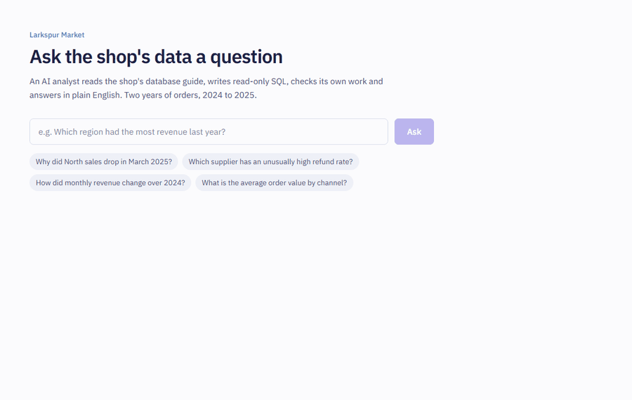

# Larkspur Analyst: an AI data analyst for a SQL database

Ask a business question in plain English. An LLM agent looks up how the database works (RAG over a
data dictionary, business glossary and example queries), writes **read-only SQL**, fixes its own
errors, and answers with the numbers, a chart, the result table and the exact SQL it ran.

> "Why did North region sales drop in March 2025?"
>
> *North gross revenue fell from $54,537 in February to $29,329 in March, then recovered in April.
> Order volume was normal; the drop is almost entirely Electronics (72 units → 8) while every other
> category grew. Many Electronics items went to zero at once, which suggests a stock-out…*

<!-- Demo GIF: record the site answering the question above (e.g. ScreenToGif), save as docs/demo.gif -->
<!--  -->

## Results

Evaluated on 30 held-out questions (none of them appear in the knowledge base), with `deepseek-chat`:

| Category | Passed |
|---|---|
| Simple lookups | 6 / 6 |
| Metrics (revenue, AOV, refund and cancellation rates) | 13 / 13 |
| Joins across tables | 8 / 8 |
| Time-based questions | 13 / 13 |
| Trend discovery (find the planted cause) | 4 / 4 |
| Must decline (personal data, deleting data, off-topic) | 3 / 3 |
| **Total** | **30 / 30** |

Median latency 3.1 s, whole evaluation $0.04. Scoring is **execution accuracy**: the gold SQL and the
agent's SQL both run, and the results are compared, not the SQL text. The first run scored 24/30.
All six failures turned out to be correct answers that my scorer rejected (top 5 instead of top 1,
40.07% vs 0.4007, "2025-03" vs a date). I made the scorer lenient on presentation only and added
tests for each case. A 30-question set is small and LLM output varies between runs, so this is a
regression check, not a benchmark claim.

## Architecture

```
Next.js (Vercel) ──POST /ask──▶ FastAPI (Render, Docker) ──▶ LangGraph agent ──▶ DeepSeek
                                                               │
                                       ┌───────────────────────┴──────────────────────┐
                               search_knowledge(query)                          run_sql(sql)
                               FastEmbed bge-small → pgvector            sqlglot validator → read-only role
                                       └──────────── PostgreSQL + pgvector (Supabase) ┘
```

- **Data**: a synthetic shop (2,000 customers, 120 products, ~10k orders, 2024–2025, fixed seed) with
  three **planted trends** as ground truth: a holiday spike, a supplier with 3× refunds, and a
  March 2025 Electronics stock-out in the North.
- **RAG over metadata, not rows**: 29 entries (table descriptions with real values, metric
  definitions, 15 verified example queries) embedded locally with FastEmbed and searched with
  pgvector. RAG tells the model *how* to query; SQL computes the exact numbers.
- **Agent**: a LangGraph loop (agent → tools → agent) with two tools, max 8 tool calls.
  Database errors go back to the model so it can fix its query. At the limit, it must answer from
  what it found instead of giving up.
- **Safety in layers**: an AST validator (single SELECT, allowed tables only, no dangerous
  functions, LIMIT ≤ 200), READ ONLY transactions, a 5 s statement timeout, and a role with
  SELECT on five objects. Personal data is hidden behind a `customers_safe` view. The prompt is
  never the security boundary.
- **API**: FastAPI + Pydantic, per-IP rate limit, CORS, LLM outage → 503.
- **Frontend**: the answer next to its evidence (chart, table, SQL) and a numbered step trace
  showing every search, failed query and fix.

Design reasoning for every choice is in [DECISIONS.md](DECISIONS.md).

## Run it locally

Needs Docker Desktop, [uv](https://docs.astral.sh/uv/), Node 20+ and a DeepSeek API key.

```bash
docker compose up -d db                                  # Postgres + pgvector
cp backend/.env.example backend/.env                     # then put your DEEPSEEK_API_KEY in it
uv run --project backend python -m data.setup_db         # build tables, data, roles, knowledge
cd backend && uv run uvicorn app.main:app --reload       # API on http://localhost:8000/docs
cd frontend && cp .env.example .env.local && npm install && npm run dev   # http://localhost:3000
```

Or ask from the terminal: `cd backend && uv run python -m app.cli "Which supplier has the most refunds?"`

```bash
cd backend && uv run pytest        # 170+ tests, no API key needed (agent tests use a scripted fake LLM)
cd backend && uv run python -m evals.run_eval   # the 30-question evaluation (calls DeepSeek, ~$0.04)
```

## Deploy (free tiers)

1. **Database: Supabase.** Create a project, enable the `vector` extension, then build it from
   your machine:
   `DATABASE_URL_ADMIN="<supabase connection string>" ANALYST_RO_PASSWORD="<strong password>" uv run --project backend python -m data.setup_db`
2. **API: Render.** New → Blueprint → this repo (uses `render.yaml`). Fill in `DEEPSEEK_API_KEY`,
   `DATABASE_URL_ADMIN`, `DATABASE_URL_RO` (user `analyst_ro` with the password above) and
   `ALLOWED_ORIGINS` (your Vercel URL).
3. **Frontend: Vercel.** Import the repo, root directory `frontend`, set
   `NEXT_PUBLIC_API_URL` to the Render URL.
4. Set a monthly spend limit on the DeepSeek account. The API also rate-limits each visitor to
   10 questions an hour.

## Project layout

```
data/       schema, synthetic data generator, roles, knowledge base (YAML) and loaders
backend/    app/ (agent, tools, SQL safety, knowledge search, API), tests/, evals/, Dockerfile
frontend/   Next.js site
.github/    CI: ruff + pytest against a pgvector service, frontend lint + build, Docker build
```
