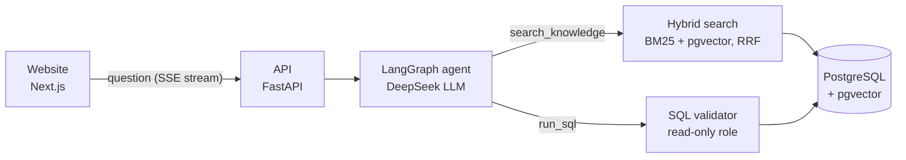

# RAG Data Analyst

**Ask a business question in plain English. An AI agent finds the answer in a SQL database, safely, and shows its work.**

[](https://rag-data-analyst-eight.vercel.app)
[](https://github.com/ShaneFun/RAG-data-analyst/actions/workflows/ci.yml)


<sub>Free hosting: if nobody has used the demo for a while, the first question can take up to a minute while the server wakes up.</sub>

## Highlights

| | |
|---|---|
| **30 / 30** | on a held-out evaluation set (execution accuracy, unseen questions) |
| **88% → 92%** | top-1 retrieval accuracy after adding hybrid search (BM25 + vectors, RRF) |
| **~3 s** | median answer time, about **$0.001** per question |
| **199 tests** | run in CI on every push, with a real Postgres + pgvector |
| **10 / 10** | tricky prompts passed: prompt injection, requests for personal data, a question in Malay, data that doesn't exist |

## What it does

- **Understands the question** by searching a knowledge base (RAG): table descriptions, business definitions, example SQL and a data handbook.
- **Writes read-only SQL**, runs it through four safety layers, and **fixes its own mistakes** when a query fails.
- **Answers in plain English** with the evidence: chart, table, the exact SQL, and a live step-by-step trace.
- **Refuses** to delete data, reveal personal data, or answer off-topic questions.

## How it works



- **RAG over metadata, not rows:** the AI retrieves *how* to query (tables, definitions, examples); the database computes the exact numbers.
- **Hybrid retrieval:** header-based chunking with parent-child retrieval, BGE embeddings in pgvector, BM25 keyword search, fused with Reciprocal Rank Fusion.
- **Agent loop:** the model decides each step (search, query, retry) up to 8 tool calls, then must answer from what it found.
- **Safety in layers:** AST-validated single SELECT on 5 allowed tables, read-only transactions, 5 s timeout, a read-only database role, and no personal data visible. The prompt is never the security boundary.
- **Synthetic data with planted trends** (holiday spike, a bad supplier, a regional stock-out) acts as an answer key for testing.

Design reasoning for every choice: [DECISIONS.md](DECISIONS.md)

## Tech stack

| Layer | Tools |
|---|---|
| AI | LangGraph, LangChain, DeepSeek, FastEmbed (BAAI/bge-small-en-v1.5), rank-bm25 |
| Backend | Python 3.12, FastAPI, Pydantic, sqlglot, psycopg |
| Data | PostgreSQL 16 + pgvector |
| Frontend | Next.js, React, TypeScript, Tailwind CSS, Recharts |
| DevOps | Docker, GitHub Actions, Render, Vercel, Supabase, uv, pytest, ruff |

<details>
<summary><b>Detailed evaluation results</b></summary>

**Answers:** 30 questions the agent has never seen, scored by **execution accuracy**: the correct SQL and the agent's SQL both run, and the *results* are compared (not the SQL text).

| Category | Passed |
|---|---|
| Simple lookups | 6 / 6 |
| Metrics (revenue, AOV, refund and cancellation rates) | 13 / 13 |
| Joins across tables | 8 / 8 |
| Time-based questions | 13 / 13 |
| Trend discovery (find the planted cause) | 4 / 4 |
| Must decline (personal data, deleting data, off-topic) | 3 / 3 |

The first run scored 24/30, but every failure was a correct answer my scorer rejected (e.g. 40.07% vs 0.4007), so I fixed the scorer and added a test for each case. 30 questions is a regression check, not a benchmark claim.

**Retrieval:** 25 search queries with known correct entries (free to run, no LLM).

| Search mode | recall@5 | hit@1 | MRR |
|---|---|---|---|
| Vector only | 100% | 88% | 0.923 |
| BM25 only | 100% | 64% | 0.798 |
| **Hybrid (RRF)** | **100%** | **92%** | **0.953** |

</details>

<details>
<summary><b>Run it locally</b></summary>

Needs Docker Desktop, [uv](https://docs.astral.sh/uv/), Node 20+ and a DeepSeek API key.

```bash
docker compose up -d db                                  # Postgres + pgvector
cp backend/.env.example backend/.env                     # then put your DEEPSEEK_API_KEY in it
uv run --project backend python -m data.setup_db         # tables, data, roles, knowledge base
cd backend && uv run uvicorn app.main:app --reload       # API: http://localhost:8000/docs
cd frontend && cp .env.example .env.local && npm install && npm run dev   # http://localhost:3000
```

```bash
cd backend && uv run pytest                     # all tests (no API key needed: fake LLM)
cd backend && uv run python -m evals.run_eval   # answer evaluation (calls DeepSeek, ~$0.04)
cd backend && uv run python -m evals.retrieval  # retrieval evaluation (free)
cd backend && uv run python -m evals.adversarial  # tricky prompts: injection, languages, missing data (~$0.01)
cd backend && uv run python -m app.cli "Which supplier has the most refunds?"
```

</details>

<details>
<summary><b>Deploy (free tiers)</b></summary>

1. **Database: Supabase** (region Frankfurt). Copy the **Session pooler** connection string, then run `uv run --project backend python -m data.setup_remote`. It asks for the string and password (hidden), builds everything, and prints `DATABASE_URL_RO`.
2. **API: Render.** New → Blueprint → this repo (`render.yaml`). Set `DEEPSEEK_API_KEY`, `DATABASE_URL_RO` and `ALLOWED_ORIGINS` (your Vercel URL). The API never receives the admin password.
3. **Website: Vercel.** Import the repo, root directory `frontend`, set `NEXT_PUBLIC_API_URL` to the Render URL.
4. Cost control: DeepSeek is prepaid, and the API allows 10 questions an hour per visitor and 200 a day in total.

</details>

## Project layout

```
data/       schema, synthetic data generator, read-only role, knowledge base + loaders
backend/    app/ (agent, tools, SQL safety, hybrid search, API), tests/, evals/, Dockerfile
frontend/   Next.js website
```
